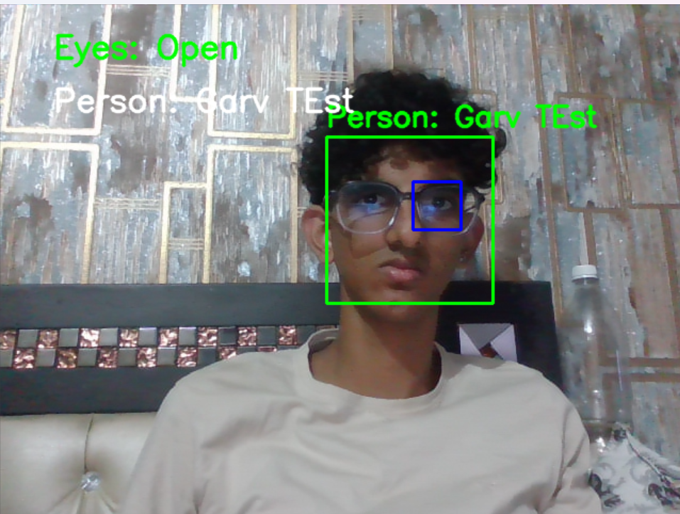
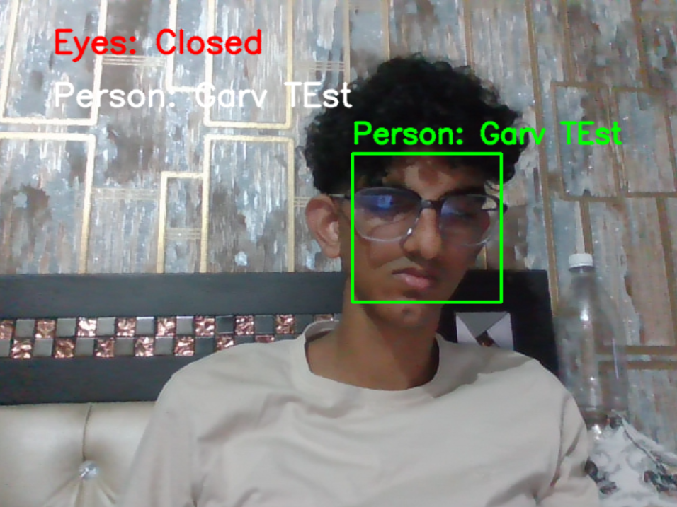

# AI-based Attendance Tracker with Behavioural Tracking and Phone Recognition

# Sample Images

 


## Overview
This project is designed to track attendance using AI and facial recognition. It can also monitor student behavior during class, detecting if students are distracted or not paying attention. Additionally, it includes a functionality for phone usage detection.

## Features
- Facial recognition for attendance tracking
- Behavioural tracking (eyes open/closed, distraction)
- Phone usage detection (to be implemented)

## Prerequisites
Before running the scripts, ensure you have the following software installed:
- Python 3.x
- OpenCV
- Other required libraries (see `requirements.txt`)

## Setup
1. **Clone the repository:**
   ```bash
   git clone https://github.com/Securegarv20/AI-based-Attendance-Tracker-with-behavioural-tracking-and-phone-recognition.git
   cd AI-based-Attendance-Tracker-with-behavioural-tracking-and-phone-recognition
2. **Install the required packages: Run the following command to install all the necessary libraries**
   ```bash
   pip install -r requirements.txt

3. **Collect face data: Run the following script to collect facial data (with and without glasses):**
   ```bash
   python image_collect_v2.py

4. **Run the main attendance logging script: Once the face data has been collected, execute:**
   ```bash
   python student_log_test_v2.py

## Log Files
Logs of each activity can be found in the log_data folder, under a subfolder named after the user, containing a log.txt file with live logs including proper text and timestamps.

## Additional Information
1. Download the Haar Cascade File: Ensure you have the see `haarcascade_frontalface_default.xml` file available for facial recognition. You can download it from the OpenCV GitHub repository [here](https://github.com/opencv/opencv/blob/master/data/haarcascades/haarcascade_frontalface_default.xml).

2. **Alternative Method**
You can also use the command line to download the file directly using wget (if you have it installed) or curl. Here's an example:
   ```bash
   wget https://raw.githubusercontent.com/opencv/opencv/master/data/haarcascades/haarcascade_frontalface_default.xml

## Contribution
Feel free to fork the repository, make changes, and submit a pull request if you have improvements or bug fixes.

